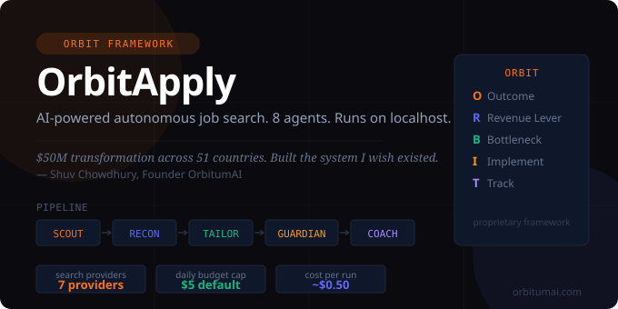

# OrbitApply

<div align="center">

**AI-powered autonomous job search and application system.**  
**Runs entirely on localhost. No cloud. No subscriptions.**

[](https://nodejs.org)
[](https://anthropic.com)
[](https://tavily.com)
[](LICENSE)
[](https://orbitumai.com)
[](https://discord.gg/ZamMu766Q)



[](https://discord.gg/ZamMu766Q)

</div>

---

> *I ran a $50M global payroll transformation across 51 countries and 24 vendors.*  
> *Then I sat on the candidate side of the table.*  
> *The process was broken. So I built the system I wish existed.*  
> *Shipped entirely through prompt engineering. No traditional code.*  
> *Now it's open source.*  
>
> — **Shuv Chowdhury**, Founder, OrbitumAI | Former Fortune 500 Enterprise Strategist

---

## What Is OrbitApply

OrbitApply is a fleet of 8 AI agents that autonomously find jobs, research companies, tailor your resume and cover letter for each role, and track every application through the full pipeline — from first apply to offer.

One click on the dashboard triggers the full pipeline:

```
SCOUT → RECON → TAILOR → GUARDIAN → LEDGER → COACH
```

Everything runs at `http://localhost:3000`. Your data never leaves your machine.

> **This is NOT a spray-and-pray tool.** OrbitApply uses the ORBIT Framework to position you strategically for each role. Quality over volume. Every document produced is tailored, ATS-optimized, and executive-grade.

---

## Screenshots

**Dashboard — run the full pipeline with one click**


**SCOUT Results — ranked job matches with fit scores**


**Pipeline — track every application through every stage**


---

## How the Pipeline Works

### SCOUT — Job Discovery (No AI cost)
Runs 15 parallel searches across 40+ job sites using a waterfall of 7 search providers (Tavily → Brave → SerpAPI → Bing → Google → Jina → DuckDuckGo). Scores every result locally in pure JavaScript — zero AI cost at this stage. Resolves the employer name from title patterns, snippet text, and company-owned career hosts, and filters out aggregator search/browse pages — no AI required.

LinkedIn is included as a public source: SCOUT targets the individual-posting path (`linkedin.com/jobs/view`) so search engines return real job pages rather than listing/search pages, with a dedicated LinkedIn pass for your highest-intent (goal) term. No LinkedIn login or scraping is involved — only publicly indexed postings. The number of scored jobs kept per run is configurable via `orbitapply.json` → `scout.maxResults` (default: 50).

**Fit scoring (0–100):**
| Factor | Points |
|---|---|
| Title match | 35 |
| Location match | 25 |
| Salary range overlap | 20 |
| Skills keyword match | 20 |

### RECON — Company Intelligence (Claude Haiku)
For each qualified job, RECON builds a structured intelligence profile: culture signals, salary benchmarks, funding stage, tech stack, red flags, opportunity score, and risk score.

### TAILOR — Document Generation (Claude Sonnet)
For every job scoring 60+, TAILOR runs two sequential Claude Sonnet calls:

**Resume tailoring** — rewrites bullet points to mirror JD language, injects ATS keywords, applies ORBIT Framework positioning in the summary, and is **industry-aware** (infers the target industry from the job and your `targetIndustries`). Runs an internal ATS simulation targeting 75+/100.

**Cover letter writing** — strict ORBIT structure (Outcome → Revenue Lever → Bottleneck → Implement → Track). 250–320 words. Executive tone. No filler phrases. Ever.

**PDF output** — both documents are rendered as polished A4 **PDFs** (header band, section rules, two-column competencies, smart page breaks, page numbers) and saved to `Apply/applications/<Company> - <Title>/`. Falls back to `.txt` if PDF generation fails.

### GUARDIAN — Safety Layer (No AI)
Runs before every TAILOR and SUBMIT action. Enforces daily budget cap ($5), apply limits (15/day), blacklist, protected contacts, and human review queue for sensitive form fields.

### LEDGER — Pipeline Tracker (No AI)
Registers every application with full metadata, status tracking, follow-up reminders, and budget accounting.

### COACH — Interview Prep (Claude Sonnet)
Auto-triggers when you update an application to Phone Screen or Interview stage — **or run it on demand** from the Pipeline application modal (**Generate / Refresh** and **View Prep Pack** buttons). Generates a full prep pack: 10 behavioral questions with STAR templates, salary negotiation script anchored 15–20% above market, and recent news items to reference naturally.

The technical/domain section is grounded in a built-in **GenAI interview question bank** (`src/data/genaiInterviewBank.js`) — 32 vetted questions across 9 categories (LLM fundamentals, RAG, agents, fine-tuning, prompt/context engineering, evaluation, governance, production/cost, AI strategy & leadership), automatically weighted to the role's seniority and grounded in your ORBIT profile.

---

## The ORBIT Framework

Every resume and cover letter OrbitApply generates follows the ORBIT Framework — proprietary IP developed by OrbitumAI:

| Pillar | What It Answers |
|---|---|
| **O — Outcome** | What specific result does this candidate deliver to THIS company? |
| **R — Revenue Lever** | How does hiring them grow revenue or cut costs? |
| **B — Bottleneck** | What problem do they solve RIGHT NOW? |
| **I — Implement** | What is their 30-60-90 day plan? |
| **T — Track** | What quantified achievements prove they can deliver? |

This is what separates OrbitApply documents from every other AI resume tool. Not keyword stuffing. Strategic positioning.

---

## Agent Summary

| Agent | Model | Role |
|---|---|---|
| **ORBI** | Claude Sonnet | Master orchestrator |
| **SCOUT** | No AI (pure JS) | Job discovery — 7 search providers, local scoring |
| **RECON** | Claude Haiku | Company intelligence |
| **TAILOR** | Claude Sonnet | Resume + cover letter generation |
| **GUARDIAN** | No AI (pure JS) | Safety: budget, rate limits, blacklist, human queue |
| **SUBMIT** | Claude Haiku | Playwright form fill (optional — off by default, requires `npx playwright install chromium`) |
| **LEDGER** | No AI (pure JS) | Pipeline tracker |
| **COACH** | Claude Sonnet | Interview prep — auto-triggered on stage change or on demand; grounded in a GenAI question bank |

---

## Search Providers (Waterfall Fallback)

OrbitApply works even without a paid Tavily subscription. It automatically falls through 7 providers until it finds results:

| Priority | Provider | Cost | Key Required |
|---|---|---|---|
| 1 | Tavily | Paid | Yes |
| 2 | Brave Search | 2000/month free | Yes |
| 3 | SerpAPI | 100/month free | Yes |
| 4 | Bing Search | 1000/month free | Yes |
| 5 | Google CSE | 100/day free | Yes |
| 6 | Jina AI | Free tier | Optional |
| 7 | DuckDuckGo | Free, unlimited | **No key needed** |

---

## Quick Start

### Prerequisites
- Node.js v18+ — [nodejs.org](https://nodejs.org)
- pnpm — `npm install -g pnpm`
- Git — [git-scm.com](https://git-scm.com)
- Anthropic API key — [console.anthropic.com](https://console.anthropic.com)
- At least one search provider key (or use DuckDuckGo — no key needed)

> **Playwright is optional.** It is only required if you enable `autoSubmit: true` in `orbitapply.json`. Most users never need it — OrbitApply generates your tailored documents and you submit manually. This keeps the default install fast and lightweight.

### Install

```bash
# Clone
git clone https://github.com/Orbitumaiopensource/Orbitapply.git
cd Orbitapply

# Install dependencies
pnpm install

# Optional — only needed if you want auto-submit (off by default)
# npx playwright install chromium

# Set up environment
cp .env.example .env
# Edit .env — add your API keys
```

### Configure your profile

```bash
# Mac/Linux
mkdir -p memory && touch memory/profile.json memory/resume.md
echo '{"companies":[]}' > memory/blacklist.json
echo '{"contacts":[]}' > memory/protected.json
mkdir -p sessions && echo '{}' > sessions/sessions.json
```

```powershell
# Windows
foreach ($dir in @("sessions","credentials","logs","Apply","memory")) {
  New-Item -ItemType Directory -Force -Path $dir
}
Set-Content -Path sessions\sessions.json -Value '{}'
Set-Content -Path memory\blacklist.json -Value '{"companies":[]}'
Set-Content -Path memory\protected.json -Value '{"contacts":[]}'
```

Edit `memory/profile.json` with your details (see [SETUP.md](SETUP.md) for the full template).

### Run

```bash
pnpm dev
```

Open [http://localhost:3000](http://localhost:3000)

---

## Daily Usage

1. Open `http://localhost:3000`
2. Type your target role and click **Start Job Search Run**
3. Watch live: SCOUT → RECON → TAILOR → LEDGER
4. Review tailored resume + cover letter **PDFs** in `Apply/applications/`
5. Update application status in the Pipeline board as responses arrive
6. Click any Pipeline card → **INTERVIEW PREP · COACH** → **Generate / Refresh** for a full prep pack (also auto-generated when you reach Phone Screen or Interview)

---

## Job Search Quality Controls

OrbitApply lets you control search quality from the **Profile Setup UI** — no config files needed:

- **Seniority keywords** — define what counts as a senior role for YOUR career level
- **Exclude titles** — filter out junior, intern, or irrelevant roles automatically
- **Minimum fit score** — set your own quality threshold (default: 50)
- **Minimum qualify score** — set the threshold for auto-passing to RECON + TAILOR (default: 70)

You can also raise how many scored jobs SCOUT keeps per run in `orbitapply.json` → `scout.maxResults` (default: 50; falls back to 20 if unset or invalid).

---

## Budget & Safety

| Control | Default | Where to Change |
|---|---|---|
| Daily budget cap | $5.00 | `orbitapply.json` → `budget.dailyLimitUSD` |
| Max applications/day | 15 | `orbitapply.json` → `guardian.maxAppliesPerDay` |
| Rate limit between submits | 45 seconds | `orbitapply.json` → `guardian.rateLimitMs` |
| Auto-submit | OFF | `orbitapply.json` → `submit.autoSubmit` |

**Approximate cost per full run (SCOUT + RECON + TAILOR for 5 jobs): $0.40–$0.80**

---

## Project Structure

```
OrbitApply/
├── agents/              # Agent SOUL.md files — identity and rules per agent
├── src/
│   ├── config/          # jobSites.js — add new job sources here
│   ├── data/            # genaiInterviewBank.js — COACH question bank
│   ├── routes/          # Express API routes
│   ├── services/        # Agent service modules
│   └── utils/           # Logger, fileStore, searchProvider
├── ui/                  # Frontend dashboard (served at localhost:3000)
├── memory/              # profile.json, resume.md, blacklist (gitignored)
├── Apply/               # Generated resumes and cover letters (gitignored)
├── .env.example         # API key template
├── orbitapply.json      # Agent config, budget, guardian settings
└── SETUP.md             # Full setup guide for Windows and Mac
```

---

## Adding Job Sites

All job sources live in one file — `src/config/jobSites.js`. Add any site in one line:

```javascript
{ domain: 'yourjobsite.com', name: 'yourjobsite', type: 'direct', active: true },
```

No other files to touch. See [CONTRIBUTING.md](CONTRIBUTING.md) for details.

---

## Security

- Server binds to `127.0.0.1` only — never accessible from the network
- All API keys in `.env` — never hardcoded, never committed
- `memory/` and `Apply/` are gitignored — your personal data never leaves your machine
- GUARDIAN enforces all safety limits — cannot be bypassed by any agent

---

## Troubleshooting

| Error | Fix |
|---|---|
| `blacklist is not iterable` | `Set-Content -Path memory\blacklist.json -Value '{"companies":[]}'` |
| `No target roles found` | Check `targetRoles` in `memory/profile.json` |
| SCOUT returns zero results | Check API keys in `.env` — DuckDuckGo works with no key |
| Budget hard stop | Raise `dailyLimitUSD` in `orbitapply.json` |
| Documents look generic | Add real numbers and achievements to `memory/resume.md` |

Full troubleshooting guide → [SETUP.md](SETUP.md)

---

## Roadmap

- [x] PDF export for tailored resumes ✅ *(shipped in v1.2.0)*
- [ ] Email outreach agent (follow-up automation)
- [ ] LinkedIn integration for direct apply
- [ ] Multi-language README
- [ ] Docker one-command setup
- [ ] Analytics dashboard (response rate trends, salary benchmarks)

---

## Contributing

See [CONTRIBUTING.md](CONTRIBUTING.md) — PRs welcome. The easiest contribution is adding a new job site to `src/config/jobSites.js`.

Join the community on [Discord](https://discord.gg/ZamMu766Q) — get help, share wins, and discuss features.

---

## Built With

[](https://anthropic.com)
[](https://nodejs.org)
[](https://expressjs.com)
[](https://tavily.com)
[](https://playwright.dev) *(optional — auto-submit only)*

---

## About the Author

**Shuv Chowdhury** — Founder & CEO, OrbitumAI (Brewongo.ai LLC)

25 years of Fortune 500 enterprise transformation across 51 countries. Led a $50M+ global payroll transformation spanning 24 vendors. Now building agentic AI systems for non-technical founders and SMBs — entirely through prompt engineering, no traditional code.

OrbitApply was built and shipped without writing a single line of traditional code. That's the point. If the tool that finds you a job can be built without code, so can your next product.

[](https://orbitumai.com)
[](https://www.linkedin.com/in/shuv)
[](https://discord.gg/ZamMu766Q)

---

## License

OrbitumAI Free License — free to use, modify, and distribute for personal and commercial use. See [LICENSE](LICENSE) for details.

---

*OrbitApply is part of the OrbitumAI open source suite. Built with the ORBIT Framework.*
